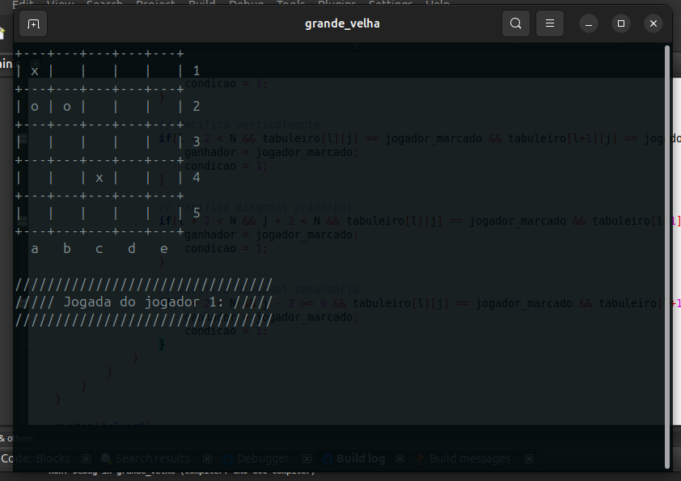

# Jogo da velha com tabuleiro 5x5

## 1. Descrição do projeto

Este projeto consiste na implementação de um jogo da velha em um tabuleiro 5x5. A calculadora foi desenvolvida com a linguagem C durante as aulas de Introdução a Programação na Universidade Federal do Cariri (UFCA) pelo aluno Otavio da Silva Ferreira.

### Funcionamento
O jogo tem dois jogadores onde o jogador 1 é o (X) e o 2 é o (O), cada jogador na sua rodada deve escolher uma cordenada, parecido com o jogo batalha naval, por exemplo (a 1) ou (b 4), ao completar três figuras iguais consecultivamente (horizontal, vertical ou diagonal) o jogoador vence.  

